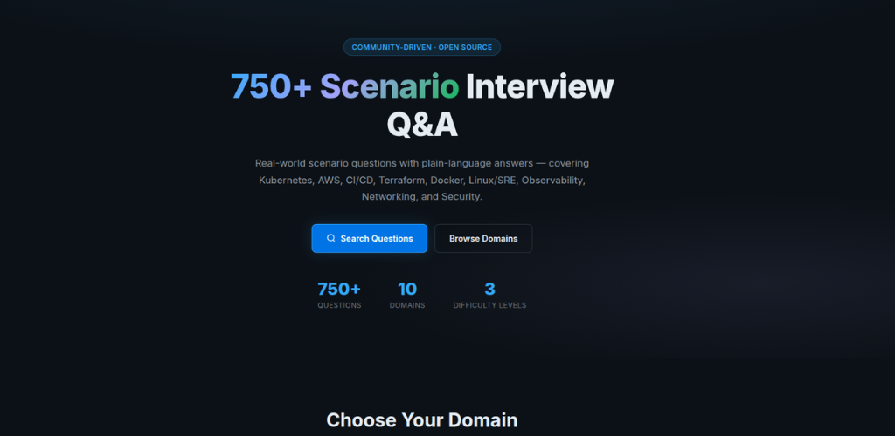
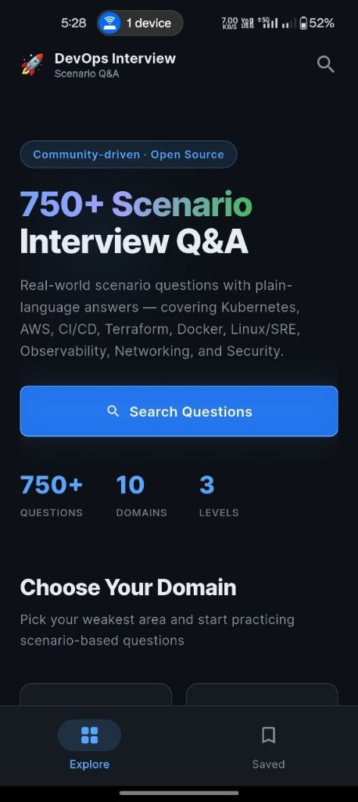

# 🚀 DevOps & Cloud — Scenario-Based Interview Questions

> **770 real-world scenario questions with plain-language answers** — covering Kubernetes, AWS, CI/CD, Terraform, Docker, Linux/SRE, Observability, Networking, Security, and Git.

This repo was built as a study companion for DevOps and Cloud engineers preparing for interviews at all levels. The focus is on **scenario-based questions** — the kind where an interviewer describes a real situation and asks *"what would you do?"* — because that's how mid-to-senior interviews actually work.

---

## 📁 Repository Structure

Each domain has its own folder with a `scenarios.md` file:

```
devops-cloud-interview-scenarios/
├── ☸️ kubernetes/scenarios.md          150 questions
├── ☁️ aws/scenarios.md                 120 questions
├── 🔄 ci-cd/scenarios.md               100 questions
├── 🏗️ terraform/scenarios.md           80 questions
├── 🐳 docker/scenarios.md              80 questions
├── 🐧 linux-sre/scenarios.md           47 questions
├── 📊 observability/scenarios.md       47 questions
├── 🌐 networking/scenarios.md          46 questions
├── 🔒 security/scenarios.md            40 questions
├── ⚙️ general-devops/scenarios.md      40 questions
├── 🌳 git/scenarios.md                 20 questions
├── 📄 README.md (this file)
├── 🤝 CONTRIBUTING.md                  (how to contribute)
├── 📜 LICENSE
└── .gitignore
```

## 🎯 Quick Navigation

| Domain | Focus | Questions |
|--------|-------|-----------|
| ☸️ [Kubernetes](./kubernetes/scenarios.md) | Container orchestration, pod debugging, deployments, networking | 150 |
| ☁️ [AWS](./aws/scenarios.md) | EC2, S3, RDS, IAM, Networking, Cost Optimization | 120 |
| 🔄 [CI/CD](./ci-cd/scenarios.md) | Pipelines, GitOps, deployments, testing, secret management | 100 |
| 🏗️ [Terraform](./terraform/scenarios.md) | State management, modules, locking, imports, best practices | 80 |
| 🐳 [Docker](./docker/scenarios.md) | Images, containers, networking, multi-stage builds, security | 80 |
| 🐧 [Linux / SRE](./linux-sre/scenarios.md) | System administration, performance tuning, incident response | 47 |
| 📊 [Observability](./observability/scenarios.md) | Monitoring, logging, metrics, tracing, alerting | 47 |
| 🌐 [Networking](./networking/scenarios.md) | VPCs, security groups, routing, DNS, load balancing | 46 |
| 🔒 [Security](./security/scenarios.md) | IAM, secrets, encryption, compliance, supply chain | 40 |
| ⚙️ [General DevOps](./general-devops/scenarios.md) | Cross-domain, disaster recovery, automation | 40 |
| 🌳 [Git](./git/scenarios.md) | Version control, branching, rebases, conflicts, recovery, history rewriting | 20 |

---

## 🌐 Read On The Go

### Web companion site

We also built a **companion website** so you can browse the same material in a browser—**instant search**, **dark and light themes** for long study sessions, and the same structure as the repo.

**Features**

- 🔍 Search across **750+** scenarios instantly
- 📊 Difficulty levels: **L1** (Fresher), **L2** (Mid), **L3** (Senior)
- 🗂️ **11 domains** — Kubernetes, AWS, Terraform, CI/CD, Docker, Linux/SRE, Observability, Networking, Security, Git, and more
- 🔖 Bookmarks for last-minute review
- 🌙 Dark & light themes, no ads, no tracking

**Live site:** [techikrish.github.io/devops-cloud-interview-scenarios](https://techikrish.github.io/devops-cloud-interview-scenarios/)



### Android app (offline)

After that, we shipped an **Android app** that packages the same scenario Q&A for **fully offline** use—no network required, so it is **ready to go** whenever you have a few minutes (commute, break room, or right before the interview).

**Features**

- 🔍 Search across **750+** scenarios instantly — offline
- 📊 Difficulty levels: **L1** (Fresher), **L2** (Mid), **L3** (Senior)
- 🗂️ **11 domains** — Kubernetes, AWS, Terraform, CI/CD, Docker, Linux/SRE, Observability, Networking, Security, Git, and more
- 🔖 Bookmarks for last-minute review
- 🌙 Dark mode, no ads, no tracking, **100% offline**

**Get it on Google Play:** [DevOps & Cloud Interview Hub](https://play.google.com/store/apps/details?id=com.techikrish.devopsinterviewhub&hl=en_IN)



---

## 🎯 How to Use This Repo

1. **Pick your weak domain** — don't study what you already know well. Start with one domain.
2. **Cover the answer first** — try to answer the scenario yourself *before* reading the answer.
3. **Focus on the "what the interviewer is testing" note** — understanding the intent helps you structure better real answers.
4. **Practice out loud** — DevOps interviews are conversations, not written tests. Talk through your reasoning.
5. **Learn from patterns** — notice recurring troubleshooting patterns across scenarios.

---

## 🏷️ Difficulty Levels

Each question is tagged with a level:

- **`[L1]`** — Fresher / 0–1 year — foundational knowledge, simple debugging
- **`[L2]`** — Mid-level / 2–4 years — production experience, architecture decisions
- **`[L3]`** — Senior / SRE / 5+ years — complex systems, design tradeoffs, incident response

---

## 🚀 Getting Started

### For Interviewees

- **1–2 weeks to interview?** Focus on `[L1]` and `[L2]` in your main domain.
- **Deep prep?** Do all scenarios in order of difficulty.
- **Weak domain?** Pick 2–3 scenarios daily for focused learning.

### For Interviewers

Use these scenarios to build interview guides:
- Pick scenarios across all difficulty levels.
- Mix different domains for well-rounded candidates.
- Scenarios are designed to be answered in 5–10 minutes.

---

## 🤝 Contributing

**Found a gap? Have a better answer? Want to add scenarios?**

See [CONTRIBUTING.md](./CONTRIBUTING.md) for detailed guidelines.

Quick start:
1. Fork this repo.
2. Add/improve scenarios in the appropriate domain folder.
3. Follow the [scenario format](./CONTRIBUTING.md#-scenario-format).
4. Open a Pull Request.

### Why Contribute?

- Share your on-call war stories (anonymized).
- Help the DevOps community prepare better for interviews.
- Get featured as a contributor.
- Build your personal brand.

---

## ⭐ If This Helped You

- **Star the repo** — it helps others discover it.
- **Share with your team** — prep together.
- **Contribute your scenarios** — help the next person.
- **Give feedback** — issues and discussions are welcome.

---

## 📄 License

This repository is licensed under the MIT License. See [LICENSE](./LICENSE) for details.

---

## 🙏 Acknowledgments

This repo is maintained by the community. Every scenario, improvement, and contribution comes from real DevOps and Cloud engineers preparing for interviews or helping others succeed.

**Maintained by the community. PRs and contributions welcome.** 💙

---

## 📞 Questions or Feedback?

- **Found an error?** Open an [Issue](https://github.com/techikrish/devops-cloud-interview-scenarios/issues).
- **Want to discuss something?** Start a [Discussion](https://github.com/techikrish/devops-cloud-interview-scenarios/discussions).
- **Have scenarios to contribute?** See [CONTRIBUTING.md](./CONTRIBUTING.md) and open a PR.

---

**Good luck with your interviews!** 🚀 You've got this. 💪
